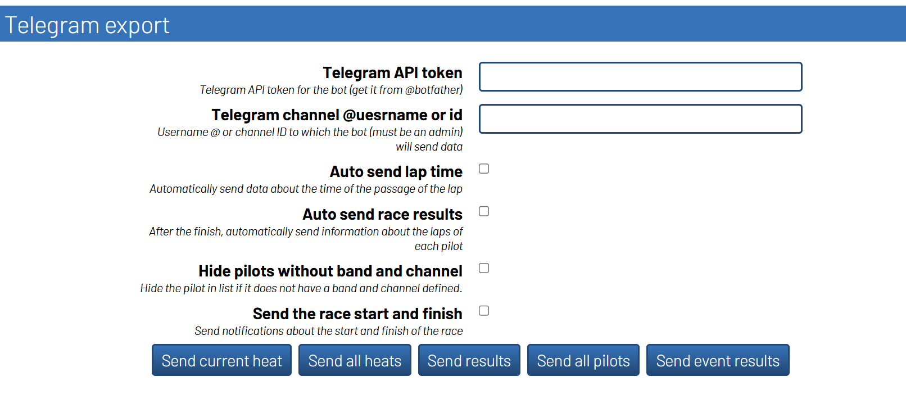

## RH Telegram Export Plugin

This plugin allows you to send race data to Telegram during events.

### Features

+ Notifications about race start and finish
+ Lap time sending during race
+ Race results with customizable format
+ Pilot list (all or only with assigned channels)
+ Heat list
+ Event results
+ Battery voltage monitoring and alerts

### Installation

1. Download the plugin archive, unzip it and move the `rh_telegram_export` folder to `\src\server\plugins\`

2. Run the following command in RH virtual environment:
   ```
   pip install -r requirements.txt
   ```

3. Restart RotorHazard

### Creating a Bot

1. Write to @BotFather in Telegram: `/newbot`
2. Follow the instructions to create a bot
3. Copy the API token (example: `123456:ABC-DEF1234ghIkl-zyx57W2v1u123ew11`)
4. Add the bot to your channel/group as administrator

> **WARNING:** Before exporting the database, make sure to clear the token field!

### Configuration

Go to the "Run" tab and find the "Telegram export" section.

#### Connection Settings

| Field | Description |
|-------|-------------|
| **Telegram API token** | Bot token from @BotFather |
| **Channel @username or id** | Channel: `@channel_name`, Group: `-100xxxxxxxxxx` |
| **Thread id** | Topic ID for channels with topics (optional) |

#### Auto-send Options (Checkboxes)

| Option | Description |
|--------|-------------|
| **Auto send lap time** | Send lap times during the race |
| **Auto send race results** | Send results after saving laps |
| **Send pilots with assigned channels** | Filter pilots list to show only those with band/channel |
| **Send the race start and finish** | Send notifications on race start/finish |

#### Battery Monitoring

| Option | Description |
|--------|-------------|
| **Enable battery voltage alert** | Enable periodic battery monitoring |
| **Battery voltage threshold (V)** | Minimum voltage before alert (default: 12V) |
| **Battery check interval (sec)** | How often to check voltage (default: 30 sec) |

#### Results Settings

| Option | Description |
|--------|-------------|
| **Results message text** | Template for results. Available placeholders: `{lp_best}`, `{lp_avg}`, `{lps_num}`, `{lps_consecutives}`, `{lps_total_time}` |
| **Sort results by** | Fastest lap / Race time / Consecutives |

### Buttons

| Button | Description |
|--------|-------------|
| **Send all heats** | Send list of all heats with pilots |
| **Send results** | Send last race results |
| **Send all pilots** | Send pilot list |
| **Send event results** | Send overall event results |
| **Send battery status** | Send current battery voltage to Telegram |

### Interface


